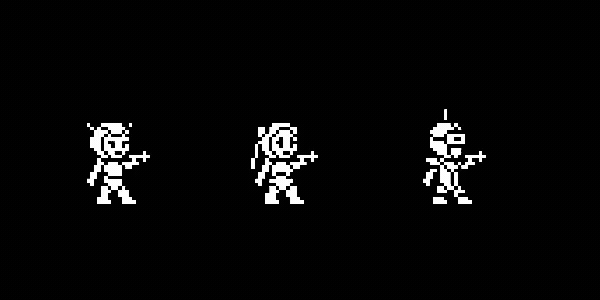

# retroGame

Welcome to Retro Platformer! This project aims to recreate the classic platformer experience with modern features, all developed using **vanilla JavaScript**.

## Added Features

- **Player Animations:** Implemented smooth animations for the player character.
- **Player Logic:** Developed comprehensive logic for player actions, including movement, jumping, shooting, and interaction.
- **Player Controls:** Enabled full control using arrow keys for movement *(left/right)* and 'X' key for shooting.
- **Double Tap Feature:** When a player moves in a certain direction and presses X, after firing a shot, they only need to stop moving but still hold X to fire another shot, which is called a double tap.
- **Bullet System:** Implemented a bullet system that dynamically generates bullets in the direction the player is facing, ensuring correct behavior even as the player changes direction. Bullets disappear when they exit the game boundaries for better optimization.
- **Camera System:** Implemented a camera system that follows the player's movements, ensuring the player remains centered on screen and enhancing gameplay visibility.
- **Collision with Floors:** Implemented collision detection between the player and floors to prevent falling through platforms.
- **Collision with Platforms:** Players can now stand and interact correctly with platforms, enhancing platformer-style gameplay.

**Note:** *The game is still under active development, with ongoing improvements and optimizations planned.*